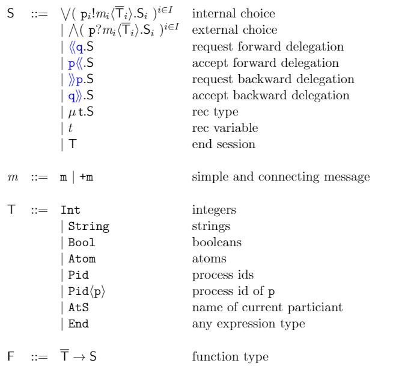

## Parse of the FErlang code
Parse of the code is divided into two steps:
- Extraction of the Erlang abstract format with the tools provided by erlang.
- Parsing of the Erlang Abstract Format and generation of the AST of the code:
   - Generation of the java classes that represent the various FErlang constructs
   - Generation of the class that deals with parsing the Erlang Abstract Format

# FErlang syntax

## Parse of the global type
The parse phase of the global type occurs as before in 2 steps:
- Generation of java classes representing the global type
- Generation of the class that takes care of parsing the global type

# Syntax of global types

# Syntax of session types

