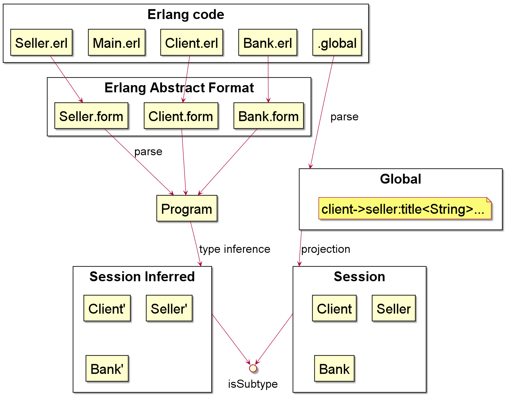

# JRAG

# Structure of packages
- print: contains the code for the pretty print Erlang code, session types and global types
- erlangtyping: contains code to derive the type of Erlang processes
- subtyping: contains the code for subtyping session types
- projection: contains the code for projection from the global type to session types of the participants
- validation: contains the code to verify the good form of External and Internal Choice session types
- utils / nameAnalisys: code to create the symbol table
- utils / equals.jrag: equals utility for typechecking

### TypeChecking.jadd
code that derives the types of the Erlang actors and checks them against their annotated/projected types
